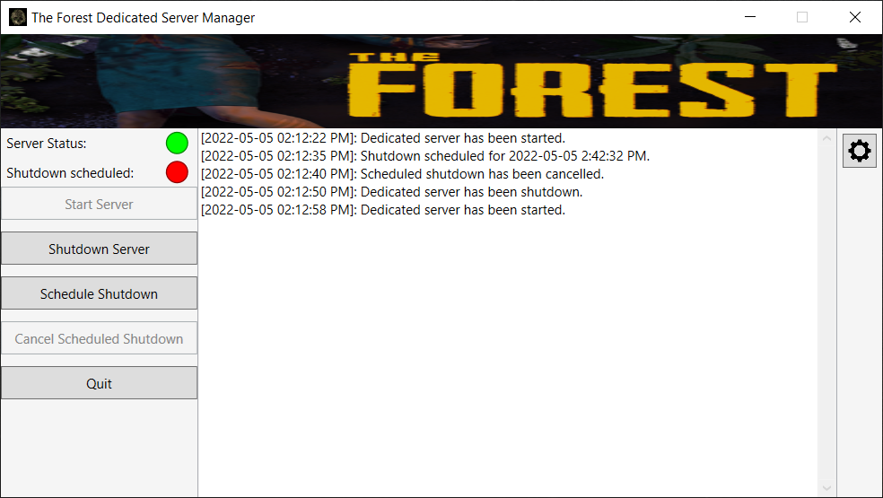

# The Forest Dedicated Server Manager
## App Overview
This is a GUI application used to manage The Forest Dedicated Server. The Forest is a video game made by Endnight Games which provides a tool called The Forest Dedicated Server that allows running a server on a local machine or through a service provider (see https://theforest.gamepedia.com/Dedicated_Servers for more details). The provided tool has very little functionality (e.g. it doesn't provide a way to start or shutdown the server), which is why The Forest Dedicated Server Manager was created. A full list of features provided by The Forest Dedicated Server Manager are listed below in the Features section. 

The Forest (Official website): https://endnightgames.com/games/the-forest  
The Forest Dedicated Server: https://theforest.gamepedia.com/Dedicated_Servers

## Features
1. Viewing server status
2. Starting The Forest Dedicated Server
3. Shutting down The Forest Dedicated Server
4. Scheduling a shutdown of The Forest Dedicated Server and/or the local machine
5. Cancelling scheduled shutdowns of The Forest Dedicated Server (and the local machine if applicable)

## App Images
### Main Screen

### Scheduling shutdown

### Settings

## Installation
Click [here](https://github.com/Conor94/the-forest-dedicated-server-manager/blob/main/TheForestDSM.Installer.msi), select Download, and then run the .msi file. You'll likely have to bypass browser security and Windows Smartscreen to run the installer after downloading it.

## NuGet Packages
This program uses code that I have published as a NuGet package on a local server. The code is published to GitHub here:
* https://github.com/Conor94/nuget-packages/tree/master/PrismMvvmBase
